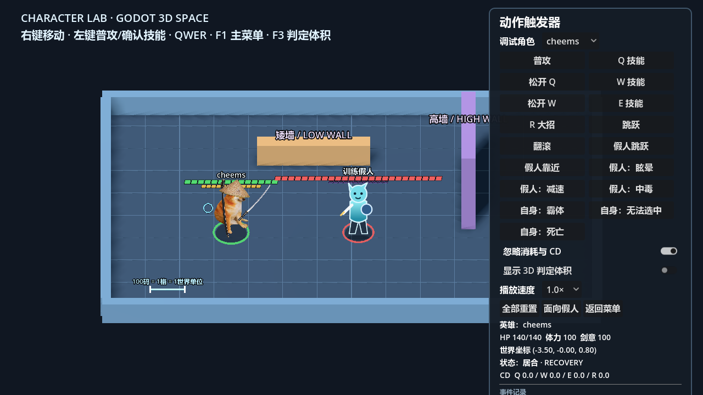
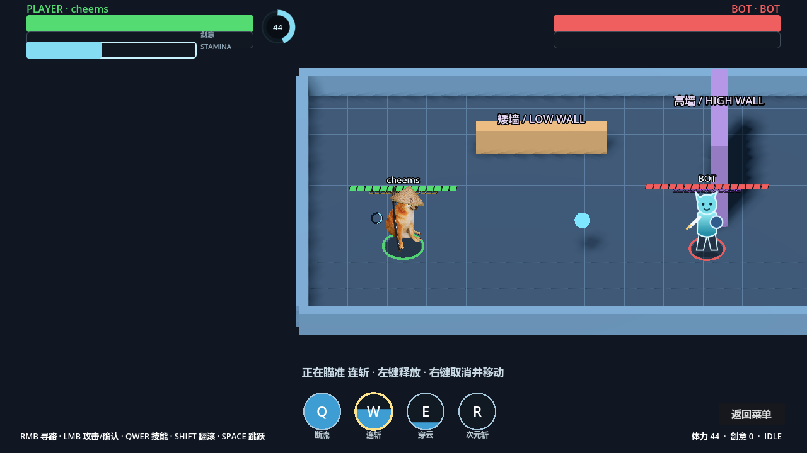
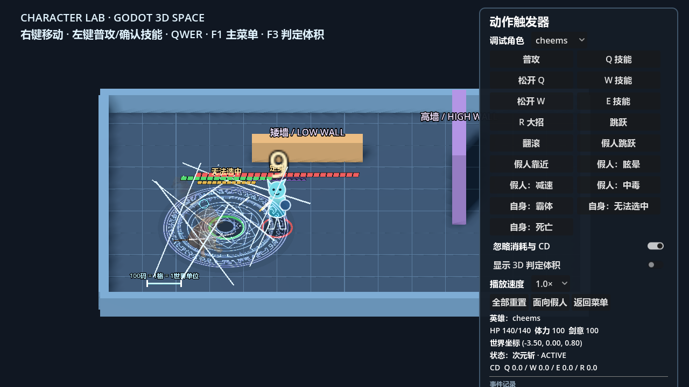
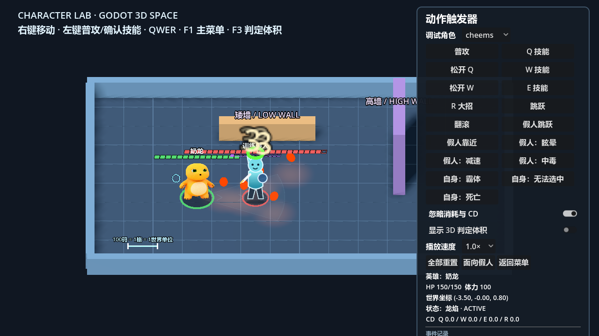

# Brawl Demo：2.5D 局域网乱斗

这是一个使用 Godot 4 制作的斜俯视 2.5D 乱斗游戏原型，也是“小小毕设”的第一版成果。玩家可以选择五名机制不同的英雄，在三张地图中与 Bot 对战，或通过局域网进行最多四人的自由乱斗。

游戏采用“3D 战斗空间 + 2D 角色表现”：移动、墙体、高度、跳跃、攻击判定和投射物在真实三维空间中结算，角色与关键动作则使用 `Sprite3D`、少量关键姿势和程序化特效表现。

> 当前版本：**v0.4.6 / First Playable Version**<br>
> Windows 试玩包：[从 Releases 下载最新版](https://github.com/huxw04/brawl-demo/releases/latest)

<table>
  <tr>
    <td></td>
    <td></td>
  </tr>
  <tr>
    <td align="center">角色实验室</td>
    <td align="center">Bot 战斗与技能指向提示</td>
  </tr>
</table>

## 当前内容

- 五名可玩英雄：Cheems、刀盾狗、贝爷、奶龙、褚赢。
- 三张数据驱动地图：四方庭院、回风峡谷、残棋台。
- Character Lab：切换英雄、触发动作、观察判定体积和墙体交互。
- Battle Arena：选择英雄，与规则驱动的本地 Bot 对战。
- 局域网乱斗：房主权威模拟，支持 2～4 人、英雄选择、地图选择、死亡复活、比分、击杀播报和结算。
- 完整的 K/D/A、输出、承伤和治疗统计，以及仅向操作者显示的伤害与治疗浮字。

<table>
  <tr>
    <td></td>
    <td></td>
  </tr>
  <tr>
    <td align="center">Cheems 次元斩</td>
    <td align="center">奶龙移动喷火</td>
  </tr>
</table>

## 操作

| 输入 | 功能 |
| --- | --- |
| 鼠标右键 | 点击地面移动；瞄准技能时取消技能并移动 |
| 鼠标左键 | 普通攻击；确认指向性技能 |
| `Q / W / E / R` | 四个英雄技能，`R` 为大招 |
| `Shift` | 翻滚，消耗三分之一体力 |
| `Space` | 跳跃 |
| 按住 `Tab` | 展开多人比分榜和网络延迟 |
| `F1` | 返回主菜单 |
| `F3` | 显示判定体积和联机诊断 |
| `F5` | 重新开始本地战斗 |

## 英雄概览

| 英雄 | 核心玩法 |
| --- | --- |
| Cheems | 连续挥刀、剑气、命中刷新突进，以及充满剑意后的次元斩 |
| 刀盾狗 | 正面格挡、重劈与盾肘，变身后获得新的位移和范围攻击 |
| 贝爷 | 远近程普攻切换、隐身背刺、钩爪移动和击杀刷新处决 |
| 奶龙 | 可转向并撞墙反弹的滚动、移动喷火、跳跃落地和持续回血 |
| 褚赢 | 棋子部署与牵引、远距离传送，以及只进不出的矩形结界 |

详细技能与数值见 [`docs/heroes/`](docs/heroes/)。新增英雄的流程见 [`docs/adding_a_hero.md`](docs/adding_a_hero.md)。

## 下载与运行试玩版

1. 从 [GitHub Releases](https://github.com/huxw04/brawl-demo/releases/latest) 下载 `BrawlDemo-v0.4.6-windows-x86_64.zip`。
2. 完整解压 ZIP，不要直接在压缩包内运行。
3. 双击 `BrawlDemo.exe`。
4. 如果 Windows 显示“未知发布者”，这是因为课堂试玩版没有代码签名证书；请确认文件来自本仓库后再运行。

试玩包仅支持 Windows x86-64，运行游戏不需要另外安装 Godot。

## 局域网联机

1. 所有玩家使用同一版本的试玩包，并连接到同一个局域网。
2. 房主在主菜单右侧选择英雄和地图，然后创建房间。
3. 其他玩家选择英雄，输入房主的局域网 IPv4 地址并加入。
4. 全员准备后由房主开始比赛。默认一局 5 分钟，或任意玩家先达到 10 次击杀。
5. 如果无法加入，请确认 Windows 防火墙允许游戏访问专用网络，并检查 UDP `24567` 端口未被拦截。

房主退出会结束当前房间。当前版本不包含公网大厅、NAT 穿透、房主迁移或断线重连。

## 从源码运行

使用 Godot 4.7.2 打开根目录的 `project.godot`，或运行：

```powershell
powershell -ExecutionPolicy Bypass -File scripts/run.ps1
```

本机启动两个联机窗口：

```powershell
powershell -ExecutionPolicy Bypass -File scripts/run_local_multiplayer.ps1
```

执行脚本、场景和自动化回归检查：

```powershell
powershell -ExecutionPolicy Bypass -File scripts/check.ps1
```

安装匹配的 Godot 4.7.2 导出模板后生成 Windows 试玩包：

```powershell
powershell -ExecutionPolicy Bypass -File scripts/package_windows.ps1
```

## 设计与实现文档

- [当前项目进度总结](docs/%E9%A1%B9%E7%9B%AE%E8%BF%9B%E5%BA%A6%E6%80%BB%E7%BB%93.md)
- [战斗框架设计](docs/framework_design.md)
- [多人联机设计](docs/multiplayer_design.md)
- [地图数据格式](docs/map_data_design.md)
- [多人手动测试清单](docs/multiplayer_manual_test_checklist.md)
- [v0.4.6 发布说明](docs/release_notes_v0.4.6.md)

## 已知限制

- 当前采用房主权威模拟。网络延迟较高时，客户端可能感受到输入反馈延迟或快速位移时的小幅修正。
- 已完成双人真人试玩和房主加三客户端的本地自动容量检查；更长时间的三、四人真人测试仍需继续。
- 英雄数值完成了第一轮调整，但不代表长期竞技平衡。
- 美术主要由 AI 辅助生成的关键姿势、拆分素材和简单程序化特效组成；尚未系统加入音效。

如果发现问题，建议记录所用英雄、地图、房主或客户端身份、操作顺序、预期结果和实际结果，并尽可能附上截图或录屏。

<details>
<summary>English summary</summary>

Brawl Demo is a Godot 4 prototype of a 2.5D LAN arena brawler. It combines a real 3D combat world with 2D character presentation and currently includes five heroes, three data-driven maps, a Character Lab, a local bot battle, and host-authoritative free-for-all matches for up to four players. Download the Windows build from [GitHub Releases](https://github.com/huxw04/brawl-demo/releases/latest), or open `project.godot` with Godot 4.7.2 to run the source project.

</details>
